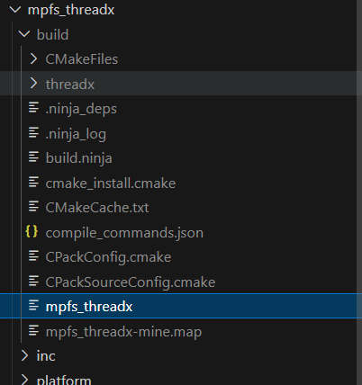
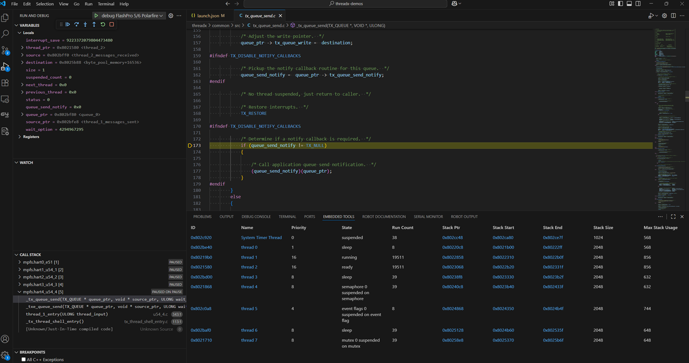
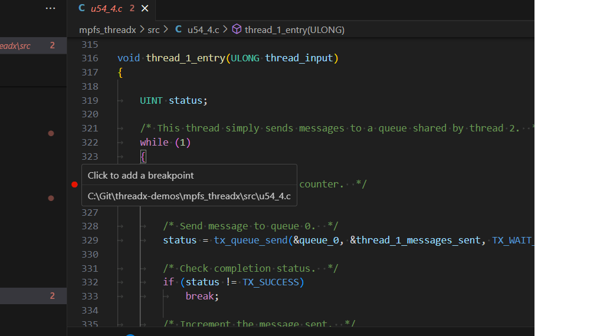
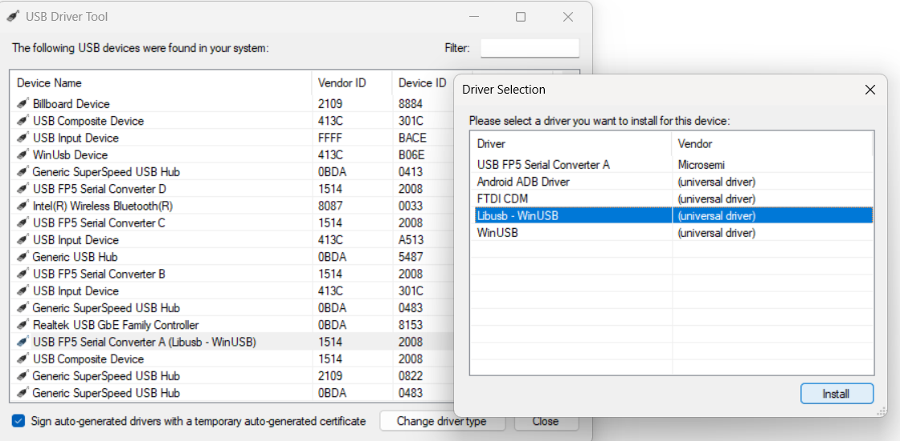

# threadx-demos

Demo for running ThreadX on a RiscV64 platform. This has been tested on Polarfire SoC on Icicle Kit, Discovery Kit and in emulation using Renode.

## Prerequisites

- Git 2.32.0.windows.1 or later if using Windows
- Git 2.34.1 or later if using Linux
- Python 3.8 to 3.13
- CMake 3.27.1 or later
- C/C++ VSCode extension. Search for `ms-vscode.cpptools` in the VSCode
extension marketplace
- Embedded Tools VSCode extension. Search for `ms-vscode.vscode-embedded-tools`
in the VSCode extension marketplace
- CMake VSCode extension. Search for `twxs.cmake` in the VSCode extension
marketplace
- Discovery Kit
    LibUSB drivers for FlashPro 5 (details in Appendix)
    Reference Design - <https://github.com/polarfire-soc/polarfire-soc-discovery-kit-reference-design/releases/tag/v2025.07>

## Step by step demo setup

In this section we will walk through getting the source code and tools required
to build the threadx demo.

Open up a terminal on Linux, or a powershell terminal on Windows to complete the following steps 

### Cloning this repository

```bash
git clone https://github.com/econnellmc/threadx-demos.git
cd threadx-demos
git checkout threadx_demo

```

### Getting the Tools

From the root of the repository, we can now add the tools. Copy/paste the following commands (based on your OS) into the terminal:

#### Windows

```ps
## riscv toolchain
Start-BitsTransfer -Source "https://github.com/xpack-dev-tools/riscv-none-elf-gcc-xpack/releases/download/v14.2.0-3/xpack-riscv-none-elf-gcc-14.2.0-3-win32-x64.zip" -Destination "xpack-riscv-none-elf-gcc-14.2.0-3-win32-x64.zip"
Expand-Archive -Path xpack-riscv-none-elf-gcc-14.2.0-3-win32-x64.zip -DestinationPath .

## ninja
Start-BitsTransfer -Source "https://github.com/ninja-build/ninja/releases/download/v1.13.1/ninja-win.zip" -Destination "ninja-win.zip"
Expand-Archive -Path ninja-win.zip -DestinationPath ninja

## openocd
Start-BitsTransfer -Source "https://github.com/microchip-fpga/openocd/releases/download/v0.12.0-mchp.0.0.3/xpack-openocd-0.12.0-4-win32-x64.zip" -Destination "xpack-openocd-0.12.0-4-win32-x64.zip"
Expand-Archive -Path xpack-openocd-0.12.0-4-win32-x64.zip -DestinationPath .

## renode
Start-BitsTransfer -Source "https://builds.renode.io/renode_1.15.2+20240819gite6e79aad3.zip" -Destination "renode_1.15.2+20240819gite6e79aad3.zip"
Expand-Archive -Path renode_1.15.2+20240819gite6e79aad3.zip -DestinationPath .
Rename-Item -Path "renode_1.15.2+20240819gite6e79aad3" -NewName "renode"

```

#### Linux

```bash
## riscv toolchain
curl -L "https://github.com/xpack-dev-tools/riscv-none-elf-gcc-xpack/releases/download/v14.2.0-3/xpack-riscv-none-elf-gcc-14.2.0-3-linux-x64.tar.gz" | tar -xz

## ninja
curl -L "https://github.com/ninja-build/ninja/releases/download/v1.13.1/ninja-linux.zip" -o ninja-linux.zip
mkdir ninja
unzip ninja-linux.zip -d ninja

## openocd
curl -L "https://github.com/microchip-fpga/openocd/releases/download/v0.12.0-mchp.0.0.3/xpack-openocd-0.12.0-4-linux-x64.tar.gz" | tar -xz

## renode
curl -LO "https://builds.renode.io/renode-1.15.2+20240819gite6e79aad3.linux-portable-dotnet.tar.gz"
tar -xzf renode-1.15.2+20240819gite6e79aad3.linux-portable-dotnet.tar.gz
mv renode_1.15.2+20240819gite6e79aad3-dotnet_portable renode

```

A fully initialized repository should look something like this:

```bash
.
├── boards
│   ├── discovery-kit
│   ├── icicle-kit-es
│   └── Kconfig
├── mpfs_threadx
│   ├── CMakeLists.txt
│   ├── inc
│   ├── platform
│   ├── riscv_toolchain.cmake
│   └── src
├── ninja
│   └── ninja
├── readme_images
│   ├── add_build_system.png
│   ├── add_openocd.png
│   ├── add_renode.png
│   ├── add_threadx.png
│   ├── add_toolchain.png
│   ├── base_clone.png
│   ├── build_location.png
│   ├── demo_running.png
│   └── libusb.png
├── README.md
├── renode
│   ├── libclrjit.so
│   ├── libcoreclr.so
│   ├── libcoreclrtraceptprovider.so
│   ├── libdbgshim.so
│   ├── libhostfxr.so
│   ├── libhostpolicy.so
│   ├── libllvm-disas.so
│   ├── libMonoPosixHelper.so
│   ├── libmscordaccore.so
│   ├── libmscordbi.so
│   ├── libSystem.Globalization.Native.so
│   ├── libSystem.IO.Compression.Native.so
│   ├── libSystem.Native.so
│   ├── libSystem.Net.Security.Native.so
│   ├── libSystem.Security.Cryptography.Native.OpenSsl.so
│   ├── licenses
│   ├── platforms
│   ├── plugins
│   ├── renode
│   ├── renode-test
│   ├── scripts
│   ├── tests
│   └── tools
├── xpack-openocd-0.12.0-4
│   ├── bin
│   ├── distro-info
│   ├── libexec
│   ├── openocd
│   └── README.md
└── xpack-riscv-none-elf-gcc-14.2.0-3
    ├── bin
    ├── distro-info
    ├── include
    ├── lib
    ├── lib64
    ├── libexec
    ├── README.md
    ├── riscv-none-elf
    └── share

30 directories, 33 files
```

### Add ThreadX fork to this directory

```bash
git clone https://github.com/econnellmc/threadx.git

```

## Build and Run in VS Code

At this point, all of the tools and code are installed and ready for build and test.

Open the `threadx-demos` folder in `VS Code` and create a new terminal in the window. On Windows this will be PowerShell by default.

Build commands using cmake:

```bash
cd mpfs_threadx
cmake --preset mpfs-disco-kit
cmake --build --preset build-mpfs-disco-kit

```

The output elf file is located at `mpfs_threadx/build/mpfs_threadx`  


### Running on the Discovery Kit

Open the Debug tab on the left hand side of the `VS Code` window and select the 'debug Flashpro 5/6 Polarfire' option, then run it by pressing the play button or `F5`. A set of prompts will appear to ask for debug parameters.

- Paste the relative path of the binary (mpfs_threadx/build/mpfs_threadx)
- microchip_riscv_efp5 (Discovery Kit)
- port 3333


### Running on the Renode Emulator

Open the Debug tab on the left hand side of the `VS Code` window and select the 'debug-renode' option, then run it by pressing the play button or `F5`. A set of prompts will appear to ask for debug parameters.

- Paste the relative path of the binary (mpfs_threadx/build/mpfs_threadx)
- port 3333
- polarfire-soc-icicle-board

## Debugging the code

The threadx demo main code is running on the U54_4 application processor. This code is found in `mpfs_threadx/src/u54_4.c`.

To add a breakpoint using `VS Code`, open the source file and hover the cursor to the left of the Line Numbers. A red circle will appear to indicate where the breakpoint will be inserted, and clicking will create the breakpoint.



## Appendix A - LibUSB for Discovery Kit

### Windows

- Download the USB Driver Tool and run it as admin. <https://visualgdb.com/UsbDriverTool/>  
- Locate the USB entry for the Discovery Kit Flashpro5 device. `USB FP5 Serial Converter A (1514,2008)`  
- Install the LibUSB driver on this device as shown in the image.  


### Linux

- The packages can be installed manually using the following commands in Ubuntu Linux,
- `sudo apt install libusb-1.0-0-dev`
- `sudo apt install libftdi*`
- `sudo apt install libhidapi-*`

Add the following lines to `/etc/udev/rules.d/80-microchip.rules`

```bash
# Microchip RISC-V Debug
ATTRS{idVendor}=="1514", ATTRS{idProduct}=="2008", MODE="666", GROUP="plugdev", TAG+="uaccess"
ATTRS{idVendor}=="1514", ATTRS{idProduct}=="2009", MODE="666", GROUP="plugdev", TAG+="uaccess"
ATTRS{idVendor}=="1514", ATTRS{idProduct}=="200a", MODE="666", GROUP="plugdev", TAG+="uaccess"
ATTRS{idVendor}=="1514", ATTRS{idProduct}=="200b", MODE="666", GROUP="plugdev", TAG+="uaccess"
```

Trigger this change by restarting the Linux PC or by running the following commands

```bash
sudo udevadm --control reload
sudo udevadm --trigger
```
